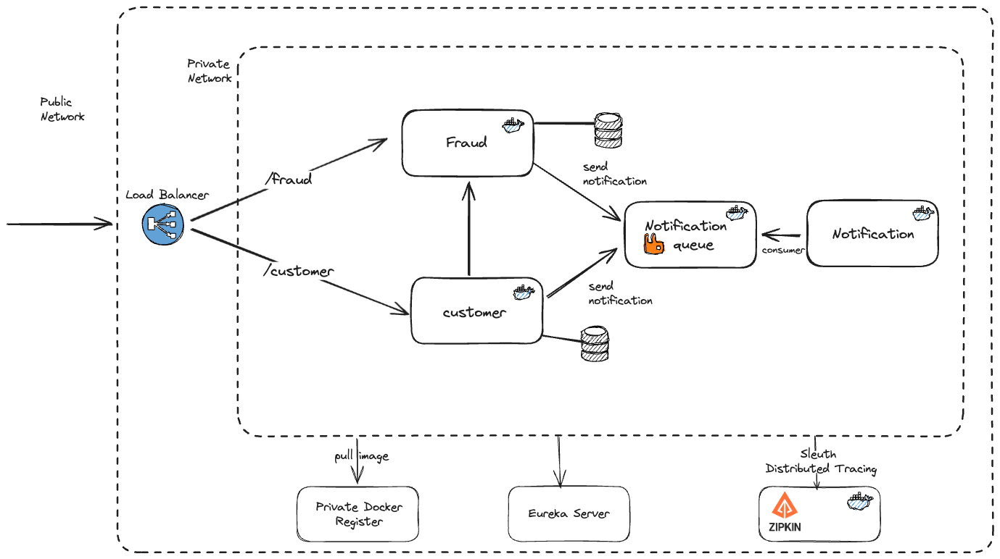

This repo is a sample project for Kubernetes & Spring Cloud Architecture(Service discovery, API gateway, Distributed Tracing).

#### Used technologies in this project are:

- Java 17
- Spring Boot 
- Spring Cloud
- Docker
- Kubernetes
- Postgresql
- RabbitMQ


## Docker
The application is dockerized, you should follow the command to run.

```http
docker-compose up -d 
```

## Diagram: 

